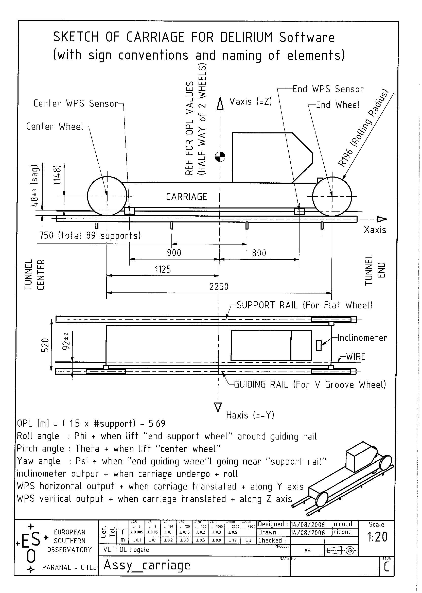

README.md

# Delay lines Delirium script

## Data 
The delirium data are taken every day by moving the delay line every day, step by step, and measuring the position in space of the carriage thanks to 2 Fogale, no contact detectors, and an inclinometer. The measures are taken every 0.375 m opl (opl = 2 physical distance). Every month also data are taken back and forward to check the hysteresis

Data are written in a ascii regular table, opl  in meter and Fogale positions Y and Z in mm, the inclinometer is in radian. The two Fogale detectors are named "center" (for the one closer to the tunnel center ) and "end" (for the one closer to the end of the tunnel). 

### Fogale WPS correction 

The string attached on both side of the tunnel is free all the way, that means it has a parabolic shape in the vertical direction and is lineary shift in horizontal. The Fogale are not exactly in horizontal/vertical position, so there are residuals vertical parabola in the horizontal data and vis versa. The data is reprojected to make the detector straight. The reprojection matrix is unique for each carriage and is in the sensors.py file. 

## Code

The code has been rewritten from the previous Matlab script. The matlab script was written sequentially, step by step and grew anarchically over the years.  Instead it has been rewritten with Python in a object oriented fashion. This in order to make it clearer and to allow the code to evolve safely. 

The defined Python objets are logical and correspond to the physical components of the delay line :

    DelayLine 
         Carriage. (Contain carriage coordinate convention function)
             Sensors. (Contain the Fogale projection function)
          Rails. (Contains the reconstructed rail coordinates)
              Supports. (Contain The state, and correction to apply on each supports)
          Delirium. (Contain the data file and functions to read/handle it)

Each object is defined in its own file. Some other files (sub modules) are also defined :

    computing.py contain common functions 
    log.py  handle the log stdout 
    io.py input output, functions to find, list and open data files remotely or locally. 

### Sensors

Sensors need a Fogale delirium file, from it the object gives the opl, incl, yctr, zctr, yend, zend sensor position correct from WPS roll error. 

Configuration :

- phi_ctr, phi_end  : the angle [rad] of the Fogale for center end end detector. Angles are different for each delay lines 

 
### carriage Attitude 

The carriage can be defined in space by 6 parameters : opl, horizontal, vertical and the 3 angles, phi, theta and psi. This natural coordinates can be transformed to Fogale measurement (and inclinometer) by geometric consideration of the carriage and position of the sensors on it. 
The attached figure shows the carriage and the main cotes. 

The transformation matrix between carriage position (Attitude) and Fogale position is called A2D and is:

     | opl  |    | 1  0  0  0   0  0  |    | opl |
     | incl |    | 0  0  0  1   0  0  |    | H   |
     | ystr | =  | 0  1  0 -48  0 -900| X  | V   |
     | zctr |    | 0  0  1  92  900 0 |    | phi | 
     | yend |    | 0  1  0 -48  0  800|    |theta|  
     | zend |    | 0  0  1  92 -800  0|    | psi |

The attitude coordinate is computed thanks to the A2D inverse matrix (D2A) and Fogale delirium position.

Configuration

### Rail

With the attitude coordinate in hand, the x (opl), y and z coordinates of the guiding rail is computed by projecting the carriage wheel contact points. The average of the two (independent) measurements at same "x"of the "center" and "end" wheel is taken. 

### Supports 

The supports object contain the correction to apply to each support to make the rail straight. The corrections are computed thanks to rail coordinates and an interaction matrix. The interaction matrix is load from a fits file, it's the rail response  on supports position change. 

    

